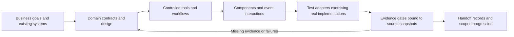

# AGUI Harness

[简体中文](README.md) | **English**

A development toolkit for building business applications that combine agents with component-based generative interfaces. It turns architectural principles into workflows that coding agents can follow, verify, and resume across sessions.

The toolkit includes Markdown specifications, **five Skills**, JSON Schemas, a local evidence-gating CLI, and runnable service-desk and UI examples beyond e-commerce.

**This is a design and verification toolkit, not an agent runtime that replaces your business system.** It checks declared controls and test evidence; documentation and gates alone cannot guarantee model correctness or production efficiency. Here, AGUI refers to the application design pattern. [AG-UI](https://docs.ag-ui.com/introduction) is an optional event transport protocol; this package does not yet include an official protocol-compatible adapter.

This README is available in English. The linked Skills, specifications, and example documentation are currently primarily in Simplified Chinese.

## Where to start

| Goal | Entry point |
|---|---|
| Start or resume work with a coding agent | [Entry Skill](skills/agui/SKILL.md) |
| Define system boundaries | [Architecture](skills/agui-design/references/architecture.md) |
| Define reusable entities and fields | [Data contracts](skills/agui-design/references/data-contracts.md), [application schemas](schemas/README.md) |
| Standardize business states and commits | [Workflows](skills/agui-design/references/workflows.md) |
| Design generated interfaces and recovery | [Interaction](skills/agui-build/references/interaction.md) |
| Design product experiences and visual interfaces | [UI design Skill](skills/agui-ui/SKILL.md), [interactive workbench](examples/ui-workbench/index.html) |
| Manage performance, concurrency, and failures | [Runtime controls](skills/agui-build/references/runtime.md) |
| Evaluate quality and human efficiency | [Evaluation](skills/agui-verify/references/evaluation.md) |
| Run gates and connect tests | [Harness contract and commands](skills/agui/references/harness.md) |
| Explore other business domains | [Runnable service desk](examples/service-desk/README.md), [equipment-booking design](examples/equipment-booking-design/README.md), [domain mappings](examples/domain-mapping.md) |
| Understand the research and design decisions | [Provenance](skills/agui/references/provenance.md) |

## How the harness guides development



- **Separate model reasoning from business authority.** The model interprets requests and proposes options. Business code enforces permissions, intent scope, versions, approval, idempotency, and authoritative outcomes.
- **Keep work resumable.** `.agui/contract.json` holds the machine-readable contract, `STATE.json` records objectives and decisions, and `HANDOFF.md` reports current evidence gaps.
- **Make gates executable.** Check schemas, tool and workflow references, applicable controls, test-case mappings, actual case results, and the versions and timestamps of code, contracts, and checkers.
- **Reject unsupported completion claims.** Missing, skipped, failed, or expired evidence blocks progression. Model, dataset, and baseline versions must match the contract. Reference examples cannot pass an application release gate.
- **Close the feedback loop.** Rerun affected checks after fixes. Use negative controls to establish that tests detect defective implementations rather than treating a completed checklist as proof.

## Five Skills

| Skill | Responsibility |
|---|---|
| `$agui` | Read project state, route the current task, and resume work. |
| `$agui-design` | Define architecture, entities and facts, workflows, interaction, and acceptance contracts. |
| `$agui-ui` | Design user and operator experiences, information architecture, visual systems, design tokens, components, responsive prototypes, and accessibility checks. |
| `$agui-build` | Implement controlled tools, durable execution, component generation, budgets, and recovery. |
| `$agui-verify` | Test failure handling, model quality, load, operator efficiency, and evidence gates. |

These Skill names become available after the complete plugin is installed and loaded. This repository contains distributable plugin source; cloning it does not activate the plugin. Alternatively, ask a coding agent that supports Markdown instructions to read `skills/agui/SKILL.md`. Keep the entire directory intact so relative references and scripts continue to work.

UI design produces `DESIGN.md`, `tokens.json`, `component-inventory.json`, and a runnable prototype. Automated checks cover declared color contrast and component-state constraints. Real browser checks cover layout, keyboard interaction, and recovery; screenshot reviews assess visual hierarchy. Claims about human efficiency require evaluation with real participants.

Open the [service-desk UI prototype](examples/ui-workbench/index.html) locally to explore user and operator views, responsive layouts, change review, interrupted generation, and recovery from an unknown outcome. It runs offline with in-page mock data. The [browser validation record](examples/ui-workbench/VALIDATION.md) states what was and was not checked. The equipment-booking example provides a complete design for another domain, but does not implement the application.

You can retain your existing software development lifecycle or project workflow and use this package as the domain guidance and verifier for agent applications.

## Run locally

Run these commands from the plugin root using an available Python interpreter:

```sh
python3 -m venv .venv
.venv/bin/python -m pip install -r requirements.txt
.venv/bin/python scripts/harness.py --project examples/service-desk lint
.venv/bin/python scripts/harness.py --project examples/service-desk run
.venv/bin/python scripts/harness.py --project examples/service-desk gate --stage implementation
.venv/bin/python -m unittest discover -s tests -v
```

The example's implementation gate should pass. Its release gate **must fail** because it lacks live-model, load, full application recovery, and human-efficiency evidence, and is a reference example rather than an application:

```sh
.venv/bin/python scripts/harness.py --project examples/service-desk gate --stage release
```

Initialize a contract for your own project:

```sh
.venv/bin/python scripts/harness.py --project /path/to/project init --id my-agent-app --domain "Equipment booking"
```

Then ask your coding agent to read the entry Skill and supply the actual domain design, implementation, and tests. The initial draft does not pass the gates. Live evaluation before release requires separate authorization for the model and test environment. The package contains no credentials and does not automatically invoke models or production systems.

## Reuse across business domains

Reusable elements include identity boundaries, Evidence, Proposal/Approval, Operation/Receipt, component protocols, budgets, recovery, and evaluation methods.

Domain entities, permitted actions, business constraints, risk levels, tools, schemas, and service-level objectives must be defined for each application. Moving from e-commerce to IT support, CRM, or resource booking requires domain work beyond replacing a prompt.

The package does not require microservices, a particular model, a vector database, a message queue, or multiple agents. A small application can run in one process while preserving clear responsibility and persistence boundaries.

## Validation and known limits

See [VALIDATION.md](VALIDATION.md) for the recorded verification results. The minimal service-desk implementation uses Python's standard-library SQLite support, a trusted host-supplied actor, and independent assertions against persisted state. It does not call a model or access the network. The two negative controls—broken idempotency and completion without a receipt—must produce real test failures.

Local hashes detect stale evidence; they are not signed proof against tampering by someone who controls the repository. Test adapters also need review. The release gate checks reported execution metadata; trusted CI, traces, and original evaluation data provide stronger provenance.

Transactions across external systems still depend on those systems' idempotency and operation-query capabilities. When those capabilities are absent, an operation with an unknown outcome must not be retried blindly.

## Installation and authorization

Cloning the source does not install or enable the plugin. Use your host's plugin installation workflow, or have a coding agent read the entry Skill directly from the complete package. Merge the [AGENTS fragment](templates/AGENTS.fragment.md) into your project's existing instructions rather than replacing them.

Installing this development tool does not itself authorize live-model calls, production operations, or application releases.
