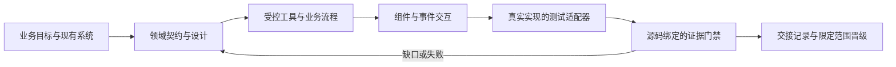

# AGUI Harness

把业务 Agent + 组件式生成界面的架构模式，转化为 Coding Agent 可以执行、检查和接续的开发工具包。包含 Markdown 规范、5 个 Skills、JSON Schema、本地证据门禁，以及非电商的可运行工单和UI交互示例。

**这是开发设计与验证工具，不是替代业务系统的 Agent 运行框架。** 能验证已声明的控制和测试证据，不能仅靠文档/门禁保证模型正确或生产效率。本包的 AGUI 指应用设计模式；[AG-UI](https://docs.ag-ui.com/introduction) 是可选事件传输协议，尚未附带官方兼容 adapter。

## 先看什么

| 目标 | 入口 |
|---|---|
| 让 Coding Agent 开始或继续工作 | [agui/SKILL.md](skills/agui/SKILL.md) |
| 理解系统边界 | [架构规范](skills/agui-design/references/architecture.md) |
| 定义可复用对象和字段 | [数据规范](skills/agui-design/references/data-contracts.md)、[应用 Schema](schemas/README.md) |
| 标准化业务状态与提交 | [流程规范](skills/agui-design/references/workflows.md) |
| 设计生成界面与恢复 | [交互规范](skills/agui-build/references/interaction.md) |
| 设计产品体验与视觉界面 | [UI设计Skill](skills/agui-ui/SKILL.md)、[交互工作台原型](examples/ui-workbench/index.html) |
| 控制性能、并发和失败 | [运行规范](skills/agui-build/references/runtime.md) |
| 判断质量和人工效率 | [评测规范](skills/agui-verify/references/evaluation.md) |
| 运行门禁、接入测试 | [Harness 合约与命令](skills/agui/references/harness.md) |
| 看非电商例子 | [可运行工单控制](examples/service-desk/README.md)、[设备预约完整设计](examples/equipment-booking-design/README.md)、[其他领域映射](examples/domain-mapping.md) |
| 了解哪些来自研究、哪些是新设计 | [来源与决策](skills/agui/references/provenance.md) |

## 这套 harness 如何约束开发



- 设计约束：模型负责理解/候选方案，业务代码强制权限、意图范围、版本、批准、幂等和结果。
- 开发接续：`.agui/contract.json` 作为机器契约，`STATE.json` 存目标与决定，`HANDOFF.md` 记录当前证据缺口。
- 可执行门禁：检查schema、工具和流程引用、适用控制、测试归属、真实case结果、代码/契约/检查器版本与时间。
- 防止假完成：缺失/跳过/失败/过期证据均阻断；模型、数据集和基线版本必须匹配；参考示例不能通过应用发布门。
- 反馈循环：每次修复后重跑受影响范围，负控检验测试确实会抓住错误实现；不以勾选清单代替执行。

## 五个 Skills

- `$agui`：读取目标工程状态，路由本次任务并接续。
- `$agui-design`：架构、实体/事实、流程、交互和验收契约。
- `$agui-ui`：用户与运营体验、信息架构、视觉系统、设计tokens、组件、响应式原型和可访问性验证。
- `$agui-build`：受控工具、持久执行、组件生成、预算和恢复。
- `$agui-verify`：故障注入、模型质量、负载、运营效率和证据门禁。

这些名称需在完整插件安装并加载后使用。本仓库提供可分发的插件源码；克隆仓库不会自动启用插件。也可直接让支持Markdown指令的Coding Agent读取 `skills/agui/SKILL.md`；保留整个目录，以便相对引用和脚本正常工作。

UI设计会产出DESIGN.md、tokens.json、component-inventory.json和可运行原型。机器检查覆盖声明颜色对比与组件状态约束；真实浏览器另验布局、键盘和恢复，截图review检查视觉层级；真实人员评测才用于效率结论。

可直接体验 [服务台交互原型](examples/ui-workbench/index.html)：用户/运营双视图、响应式布局、变更审查、生成中断与结果待确认恢复。原型离线运行，仅使用页面内模拟数据；[实际浏览器检查记录](examples/ui-workbench/VALIDATION.md) 列明已验与未验范围。设备预约示例提供另一领域的完整设计工件，尚未实现应用。

现有SDLC或项目流程可以继续作为主流程，把本包当作Agent应用领域规范和验证器；不要求采用另一套研发管理工具。

## 本地运行

在本插件目录执行（使用你自己的Python环境；本机若系统Python不可用，可选现有可用解释器）：

```sh
python3 -m venv .venv
.venv/bin/python -m pip install -r requirements.txt
.venv/bin/python scripts/harness.py --project examples/service-desk lint
.venv/bin/python scripts/harness.py --project examples/service-desk run
.venv/bin/python scripts/harness.py --project examples/service-desk gate --stage implementation
.venv/bin/python -m unittest discover -s tests -v
```

示例的 implementation gate 应通过；`gate --stage release` **应失败**，因为它没有真实模型、负载、完整应用恢复或效率基线。

对自己的目标仓库：

```sh
.venv/bin/python scripts/harness.py --project /path/to/project init --id my-agent-app --domain "设备预约"
```

然后让 Coding Agent 读取入口 Skill，填入真实领域设计、实现和测试。初始 draft 不通过门禁。发布前真实评测需要独立模型/测试环境授权；本包没有凭证，也不会自动调用模型或生产系统。

## 可复用性与必要领域工作

跨场景共享的是身份边界、Evidence、Proposal/Approval、Operation/Receipt、组件协议、预算、恢复和评测方法。领域实体、可执行动作、业务约束、风险等级、工具/schema及SLO需要按真实场景定义。IT工单、CRM、资源预约不能靠替换电商prompt完成迁移。

本包不会强制微服务、特定模型、向量数据库、消息队列或多Agent。小系统可同进程，但责任和持久化边界仍需成立。

## 验证与已知边界

最新实测见 [VALIDATION.md](VALIDATION.md)。最小工单示例使用标准库SQLite、可信宿主Actor和独立状态断言，不访问模型或网络。幂等失效、无凭证完成两个负控应产生真实测试失败。

本地哈希用于发现陈旧证据，不提供对抗仓库owner篡改的签名证明。测试adapter本身必须审查；release门读取声称的真实运行信息，可信CI/trace与原始评测数据提供更强来源证明。跨系统事务仍取决于对方幂等与查询能力；没有这些能力的未知写不能盲目重试。

## 使用授权边界

克隆源码不等于安装或启用。需要接入时，优先复用宿主的插件安装流程；普通Coding Agent可以直接读取完整包的入口文件。可将 [AGENTS片段](templates/AGENTS.fragment.md) 合并到目标工程的约定中，而不是覆盖已有约定。安装开发工具不自动授权调用真实模型、操作生产系统或发布业务应用。
